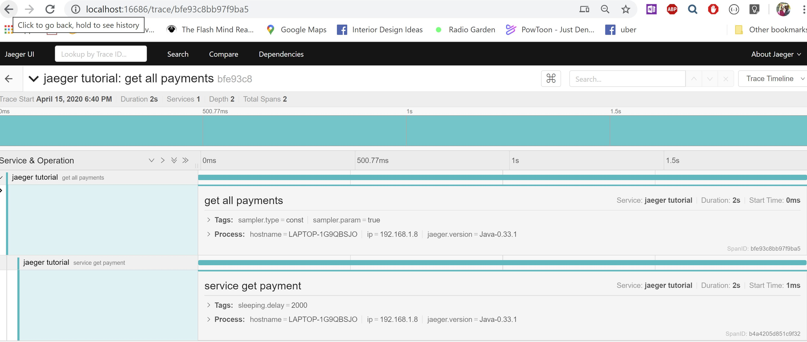
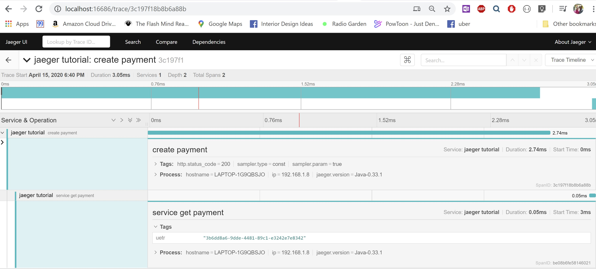

# Jaeger Sample using the Springboot

Quick and dirty Spring Boot project with some basic Jaeger tracing enabled.

Use gradle build copyLocal to run from local subdirectory.

Use gradele build copyDeps to run in container. Build image in docker subdirectory.

###### Docker Jaeger installation 
docker run -d --name jaeger -p 16686:16686 -p 6831:6831/udp jaegertracing/all-in-one:1.9

Above docker image uses non production image (all-in-one) data gets stored in in-memory rather than casandra or ES
Access UI @ http://localhost:16686/search

all-in-one
----------
https://www.jaegertracing.io/docs/1.17/getting-started/

Jaeger Screenshots
------------------

Scaling Jaegar
1. https://www.youtube.com/watch?v=tFZAHWl8y_I

Docker Image creation and Container starting
-------------------------------------------
Make sure you run copyDeps gradle task, this copies lib.

Create docker image with following command (creates tag 0.0.1 and also make same version as latest)  
`docker build -t gowthg/springboot:0.0.1 -t gowthg/springboot:latest -f Dockerfile . `

Create container with following command, this gives containerId  
`docker create -t -i gowtham-springboot  
 adf7f31c42692f7819942f4ced9fa4b324a400e60e115d743bb30089092d8f1c`    

Start container with following command  
`docket start -a -i adf7f31c42692f7819942f4ced9fa4b324a400e60e115d743bb30089092d8f1c`  